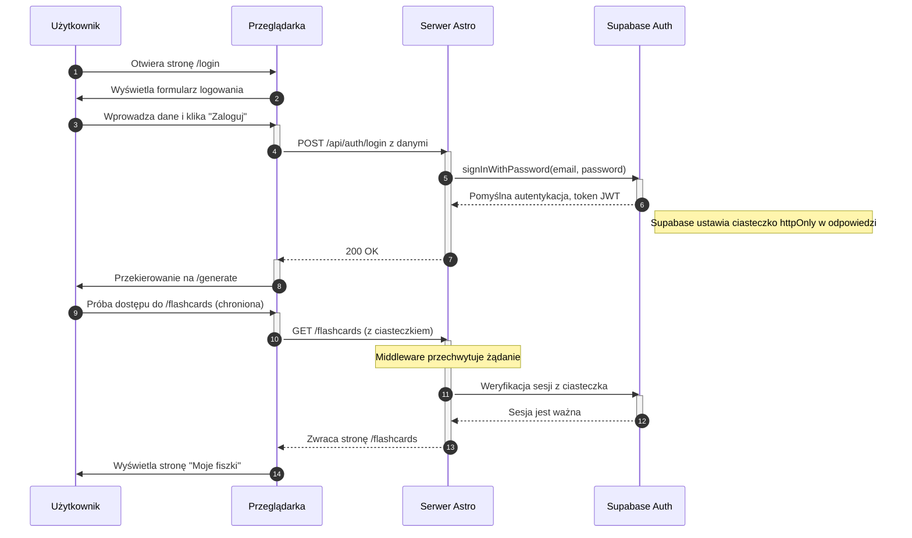

<authentication_analysis>

### Przepływy Uwierzytelniania

1.  **Logowanie**: Użytkownik podaje e-mail i hasło. Aplikacja weryfikuje dane w Supabase, a w odpowiedzi ustawiane jest ciasteczko sesji.
2.  **Rejestracja**: Nowy użytkownik podaje e-mail i hasło. Supabase tworzy użytkownika i wysyła e-mail weryfikacyjny.
3.  **Wylogowanie**: Sesja użytkownika jest usuwana po stronie Supabase, a ciasteczko sesyjne jest czyszczone.
4.  **Dostęp do chronionych zasobów**: Middleware weryfikuje ważność ciasteczka sesyjnego przed udzieleniem dostępu do chronionych stron, takich jak `/flashcards`.
5.  **Resetowanie hasła**: Użytkownik może poprosić o link do zresetowania hasła, który jest wysyłany na jego adres e-mail.

### Główni Aktorzy i Interakcje

- **Użytkownik**: Inicjuje akcje logowania, rejestracji, wylogowania.
- **Przeglądarka (Komponenty React)**: Renderuje formularze, przesyła dane do API Astro.
- **Serwer Astro (Middleware i API)**: Przetwarza żądania, komunikuje się z Supabase.
- **Supabase Auth**: Dostawca usługi uwierzytelniania, zarządza sesjami i danymi użytkowników.

### Zarządzanie Tokenami

Supabase Auth automatycznie zarządza tokenami JWT. Po pomyślnym zalogowaniu, ustawia w przeglądarce ciasteczko `httpOnly`, które zawiera token sesji. Biblioteka kliencka Supabase po stronie serwera automatycznie odczytuje to ciasteczko do weryfikacji sesji. Odświeżanie tokenów jest również obsługiwane automatycznie.

### Kroki Autentykacji

1.  **Żądanie**: Akcja użytkownika w przeglądarce inicjuje żądanie do API Astro.
2.  **Walidacja**: Endpoint API waliduje otrzymane dane (np. za pomocą Zod).
3.  **Uwierzytelnianie**: Wywoływana jest odpowiednia metoda Supabase Auth (`signInWithPassword`, `signUp`).
4.  **Zarządzanie sesją**: Supabase tworzy lub usuwa sesję i zarządza ciasteczkiem.
5.  **Odpowiedź**: API zwraca odpowiedź (sukces lub błąd) do przeglądarki.
6.  **Przekierowanie**: Przeglądarka przekierowuje użytkownika na odpowiednią stronę.
7.  **Ochrona trasy (Middleware)**: Przy próbie dostępu do chronionej strony, middleware weryfikuje sesję przed wyrenderowaniem treści.
    </authentication_analysis>

<mermaid_diagram>

</mermaid_diagram>
