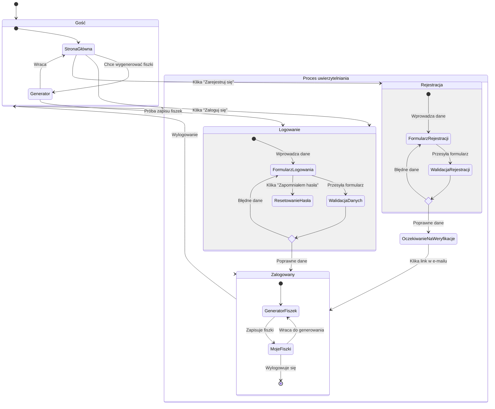

<user_journey_analysis>

### Ścieżki Użytkownika

1.  **Rejestracja Nowego Użytkownika**: Użytkownik trafia na stronę, przechodzi do formularza rejestracji, wypełnia go, odbiera e-mail weryfikacyjny i po kliknięciu w link staje się zalogowanym użytkownikiem.
2.  **Logowanie Istniejącego Użytkownika**: Użytkownik wchodzi na stronę, przechodzi do formularza logowania, podaje swoje dane i uzyskuje dostęp do chronionych zasobów.
3.  **Interakcja jako Niezalogowany Użytkownik**: Użytkownik może korzystać z publicznych części aplikacji, np. generować fiszki. Próba zapisu fiszek skutkuje prośbą o zalogowanie lub rejestrację.
4.  **Resetowanie Hasła**: Użytkownik, który zapomniał hasła, może poprosić o link do jego zresetowania, który zostanie wysłany na jego adres e-mail.
5.  **Sesja Zalogowanego Użytkownika**: Zalogowany użytkownik swobodnie porusza się po publicznych i chronionych częściach aplikacji aż do momentu wylogowania.

### Główne Stany w Podróży Użytkownika

- **Gość**: Niezalogowany użytkownik z dostępem do publicznych stron.
- **Proces Uwierzytelniania**: Stan złożony, obejmujący logowanie, rejestrację i resetowanie hasła.
- **Oczekiwanie na Weryfikację E-mail**: Stan po pomyślnym przesłaniu formularza rejestracyjnego.
- **Zalogowany**: Uwierzytelniony użytkownik z pełnym dostępem do funkcjonalności aplikacji.

### Punkty Decyzyjne

- Czy użytkownik posiada konto? (-> Logowanie lub Rejestracja)
- Czy dane logowania są poprawne? (-> Dostęp lub Błąd)
- Czy użytkownik jest zalogowany przy próbie dostępu do chronionej strony? (-> Dostęp lub Przekierowanie do logowania)
  </user_journey_analysis>

<mermaid_diagram>

</mermaid_diagram>
