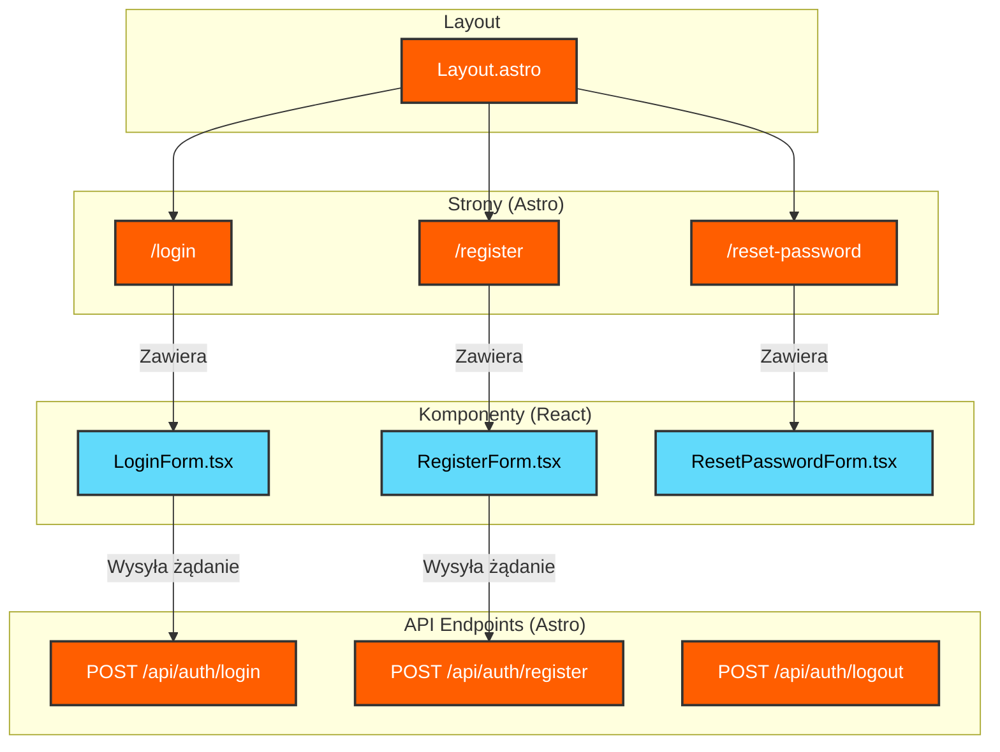

<architecture_analysis>

### Komponenty i Strony

1.  **/login (Strona Astro)**: Strona hostująca formularz logowania. Dostępna tylko dla niezalogowanych użytkowników.
2.  **/register (Strona Astro)**: Strona hostująca formularz rejestracji. Dostępna tylko dla niezalogowanych użytkowników.
3.  **/reset-password (Strona Astro)**: Strona hostująca formularz resetowania hasła.
4.  **LoginForm.tsx (Komponent React)**: Formularz z polami na e-mail i hasło. Komunikuje się z endpointem `/api/auth/login`.
5.  **RegisterForm.tsx (Komponent React)**: Formularz rejestracyjny. Komunikuje się z endpointem `/api/auth/register`.
6.  **ResetPasswordForm.tsx (Komponent React)**: Formularz do wysyłania linku resetującego hasło.
7.  **Layout.astro (Layout Astro)**: Główny layout aplikacji, który zostanie zmodyfikowany, aby warunkowo renderować elementy nawigacji (np. "Zaloguj się" vs "Wyloguj się") w zależności od stanu uwierzytelnienia użytkownika.

### Przepływ Danych

- Dane wprowadzane przez użytkownika przepływają z formularzy React do endpointów API Astro za pomocą `fetch`.
- Stan uwierzytelnienia jest zarządzany przez Supabase za pomocą ciasteczek i odczytywany przez middleware Astro, który udostępnia dane użytkownika w `Astro.locals`.
- Komponent `Layout.astro` wykorzystuje `Astro.locals.user` do dynamicznego renderowania interfejsu.

### Funkcjonalność Komponentów

- **Strony Astro**: Służą jako kontenery dla dynamicznych komponentów React.
- **Komponenty React**: Zarządzają stanem formularzy, walidacją po stronie klienta i komunikacją z API.
- **Layout Astro**: Zapewnia spójną strukturę i nawigację, która adaptuje się do stanu zalogowania użytkownika.
  </architecture_analysis>

<mermaid_diagram>

</mermaid_diagram>
